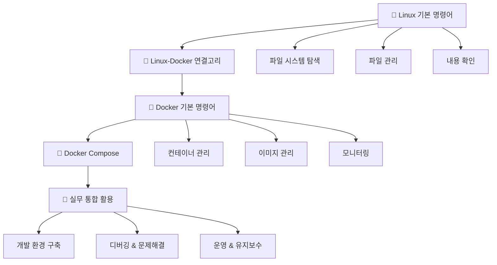

> **🎯 목표**: Linux 기본기부터 Docker 실무까지, 개발자가 알아야 할 모든 명령어를 체계적으로 학습하자!

---

## 🗺️ 학습 로드맵 Overview



---

# 🎯 PART 1: Linux 필수 기본기

> **💡 중요**: Docker 컨테이너는 Linux 환경입니다. 이 명령어들을 컨테이너 안에서도 똑같이 사용하게 됩니다!

## 📁 파일 시스템 마스터하기

### 🧭 위치 파악 및 이동

> **기본 탐색 3종 세트**
```bash
> pwd                                    # 현재 위치 확인
> ls -la                                 # 파일 목록 자세히 보기
> cd /path/to/directory                  # 디렉터리 이동
> ```

### 📋 `ls` - 파일 목록의 달인

**List**의 약자로, 파일과 디렉터리 정보를 다양하게 확인할 수 있습니다.

> **📊 ls 완전 정복**
```bash
> ls                                     # 기본 목록
> ls -l                                  # 상세 정보 (권한, 크기, 날짜)
> ls -la                                 # 숨김 파일까지 상세히
> ls -lh                                 # 파일 크기를 읽기 쉽게 (MB, GB)
> ls *.txt                               # 특정 확장자만
> ls -lt                                 # 수정 시간 순 정렬
> ls -lS                                 # 파일 크기 순 정렬
> ```

### 🚀 `cd` - 이동의 마법사

**Change Directory**로 효율적인 이동을 위한 다양한 방법들을 익혀보세요.

> **🗺️ cd 이동 테크닉**
```bash
> cd                                     # 홈 디렉터리로
> cd ~                                   # 홈 디렉터리로 (동일)
> cd ..                                  # 상위 디렉터리로
> cd ../..                               # 두 단계 위로
> cd -                                   # 이전 디렉터리로 (매우 유용!)
> cd /absolute/path                      # 절대 경로
> cd relative/path                       # 상대 경로
> ```

## 📝 파일 & 디렉터리 조작의 신

### 🗂️ 생성과 삭제

> **📁 디렉터리 관리**
```bash
> mkdir project                          # 단일 디렉터리 생성
> mkdir -p project/src/components        # 경로 전체 생성
> rmdir empty_directory                  # 빈 디렉터리 삭제
> rm -rf directory                       # 디렉터리 및 내용 모두 삭제 ⚠️
> ```

> **📄 파일 관리**
```bash
> touch file.txt                         # 빈 파일 생성
> cp file.txt backup.txt                 # 파일 복사
> cp -r directory backup_dir             # 디렉터리 복사
> mv old_name.txt new_name.txt           # 파일명 변경
> mv file.txt /new/location/             # 파일 이동
> rm file.txt                            # 파일 삭제
> rm -i important.txt                    # 삭제 전 확인
> ```

## 👀 파일 내용 확인의 고수

### 📖 다양한 방법으로 파일 읽기

> **🔍 파일 내용 보기 마스터**
```bash
> cat file.txt                           # 전체 내용 출력
> head -n 20 file.txt                    # 처음 20줄
> tail -n 20 file.txt                    # 마지막 20줄
> tail -f log.txt                        # 실시간 모니터링 ⭐
> less file.txt                          # 페이지별로 보기 (추천)
> more file.txt                          # 기본 페이지 뷰어
> ```

### 🔎 파일 정보 및 유틸리티

> **🛠️ 파일 분석**
```bash
> file document.pdf                      # 파일 형식 확인
> wc -l file.txt                         # 줄 수 세기
> du -sh directory                       # 디렉터리 크기 확인
> find . -name "*.txt"                   # 파일 검색
> grep "검색어" file.txt                  # 내용 검색
> ```

---

# 🔗 PART 2: Linux와 Docker의 만남

## 💡 왜 Linux 명령어가 Docker에서 중요한가?

> **🤝 Linux + Docker = 완벽한 조합**
> 
> 1. **Docker 컨테이너 = 격리된 Linux 환경**
> 2. **컨테이너 내부에서 Linux 명령어 그대로 사용**
> 3. **개발/디버깅/운영 모든 단계에서 필수**

### 🌉 연결 고리 이해하기

```bash
# 호스트에서 Linux 명령어 사용
ls -la
cd /project
cat config.txt

# Docker 컨테이너 안에서도 동일하게!
docker exec -it my-container bash
ls -la                                   # 컨테이너 내부 파일 확인
cd /app                                  # 컨테이너 내부 이동
cat app.log                              # 컨테이너 로그 확인
```

---

# 🐳 PART 3: Docker 명령어 마스터

## 🚀 컨테이너 생명주기 관리

### 📦 컨테이너 기본 조작

> **⚡ Docker 기본 4단 콤보**
```bash
> docker run -d --name web nginx         # 컨테이너 생성 및 실행
> docker ps                              # 실행 중인 컨테이너 확인
> docker exec -it web bash               # 컨테이너 내부 접속
> docker stop web                        # 컨테이너 중지
> ```

### 🎮 docker run 마스터 옵션들

> **🔧 실무 필수 옵션 조합**
```bash
> # 웹 서비스 실행 (포트 매핑)
> docker run -d -p 8080:80 --name my-web nginx
> 
> # 개발 환경 (볼륨 마운트 + 환경변수)
> docker run -d -p 3000:3000 \
>   -v $(pwd):/app \
>   -e NODE_ENV=development \
>   --name dev-server node:18
> 
> # 데이터베이스 (데이터 영구 저장)
> docker run -d -p 5432:5432 \
>   -v postgres-data:/var/lib/postgresql/data \
>   -e POSTGRES_DB=myapp \
>   -e POSTGRES_USER=user \
>   -e POSTGRES_PASSWORD=secret \
>   --name db postgres:14
> ```

## 🖼️ 이미지 관리의 달인

> **📥 이미지 라이프사이클**
> 
```bash
> docker pull ubuntu:20.04               # 이미지 다운로드
> docker images                          # 로컬 이미지 목록
> docker build -t my-app:latest .        # Dockerfile로 빌드
> docker rmi ubuntu:20.04                # 이미지 삭제
> docker image prune                     # 미사용 이미지 정리
> ```

## 📊 모니터링 & 디버깅 전문가

### 🔍 컨테이너 상태 진단

> **🩺 Docker 건강 체크**
```bash
> docker ps -a                           # 모든 컨테이너 상태
> docker stats                           # 실시간 리소스 사용량
> docker logs -f container_name          # 실시간 로그 추적
> docker inspect container_name          # 상세 설정 정보
> docker exec -it container_name bash    # 내부 진단용 접속
> ```

### 🛠️ 문제해결 명령어들

> **🚨 트러블슈팅 필수 툴킷**
```bash
> # 컨테이너 내부에서 Linux 명령어로 진단
> docker exec -it web bash
> ps aux                                 # 프로세스 확인
> df -h                                  # 디스크 사용량
> netstat -tlnp                          # 포트 상태 확인
> cat /etc/hosts                         # 네트워크 설정
> tail -f /var/log/nginx/error.log       # 실시간 에러 로그
> ```

---

# 🎼 PART 4: Docker Compose 오케스트레이션

## ⚡ 멀티 컨테이너 마스터

### 🎯 Docker Compose 기본기

> **🎪 여러 서비스 한 번에 관리**
 ```bash
> docker-compose up -d                   # 모든 서비스 백그라운드 시작
> docker-compose ps                      # 서비스 상태 확인
> docker-compose logs -f                 # 모든 서비스 로그 실시간
> docker-compose logs -f web             # 특정 서비스 로그만
> docker-compose down                    # 모든 서비스 중지 및 정리
> ```

### 🔧 개발 워크플로우 최적화

> **💻 개발자의 일상 명령어들**
 ```bash
> # 코드 변경 후 특정 서비스만 재시작
> docker-compose restart api
> 
> # 캐시 무시하고 새로 빌드
> docker-compose build --no-cache web
> 
> # 특정 서비스 스케일링
> docker-compose up -d --scale worker=3
> 
> # 서비스별 개별 관리
> docker-compose stop db                 # DB만 중지
> docker-compose start db                # DB만 시작
> ```

---

# 🌟 PART 5: 실무 통합 활용 시나리오

## 🔥 실제 개발 시나리오

### 📋 시나리오 1: 웹 애플리케이션 개발 환경 구축

```bash
# 1. 프로젝트 디렉터리 생성 (Linux)
mkdir -p ~/projects/my-web-app/{src,config,logs}
cd ~/projects/my-web-app

# 2. Docker Compose로 개발 환경 시작
docker-compose up -d

# 3. 애플리케이션 컨테이너에 접속해서 디버깅
docker exec -it web-app bash
ls -la /app                             # 앱 파일 확인
cat /app/package.json                   # 설정 확인
tail -f /app/logs/app.log               # 실시간 로그 확인

# 4. 데이터베이스 컨테이너 점검
docker exec -it db bash
psql -U postgres -d myapp               # DB 접속
\dt                                     # 테이블 목록 확인
```

### 📋 시나리오 2: 운영 서버 문제 해결

```bash
# 1. 전체 서비스 상태 점검
docker-compose ps
docker stats --no-stream

# 2. 문제가 있는 서비스 로그 확인
docker-compose logs --tail=100 api

# 3. 컨테이너 내부 진단
docker exec -it api bash
ps aux | grep node                      # 프로세스 상태
df -h                                   # 디스크 공간
free -h                                 # 메모리 사용량
netstat -tlnp | grep 3000               # 포트 상태

# 4. 로그 파일 상세 분석
tail -f /var/log/app/error.log
head -n 50 /var/log/app/access.log

# 5. 서비스 재시작
docker-compose restart api
```

### 📋 시나리오 3: 새로운 팀원 온보딩

```bash
# 1. 프로젝트 클론 및 환경 설정
git clone https://github.com/company/project.git
cd project

# 2. 개발 환경 한 번에 구축
docker-compose up -d

# 3. 환경 확인 및 테스트
docker-compose ps                       # 모든 서비스 정상 작동 확인
docker-compose logs web                 # 웹서버 로그 확인
curl http://localhost:8080              # 서비스 응답 테스트

# 4. 개발 시작을 위한 컨테이너 접속
docker exec -it web bash
cd /app && npm test                     # 테스트 실행
```

## 💪 고급 통합 테크닉

### 🎯 Linux + Docker 파워 조합

> **⚡ 개발자들이 매일 쓰는 황금 패턴들**
```bash
> # 1. 로그 실시간 모니터링 + 파일 저장
> docker-compose logs -f api | tee api-debug.log
> 
> # 2. 컨테이너 내부 파일을 호스트로 복사
> docker cp container-name:/app/config.json ./
> 
> # 3. 호스트 파일을 컨테이너 내부로 복사
> docker cp ./local-config.json container-name:/app/
> 
> # 4. 여러 컨테이너에서 동시에 명령 실행
> docker-compose exec web ls -la
> docker-compose exec db psql -U postgres -c "SELECT version();"
> 
> # 5. 컨테이너 내부에서 파일 검색
> docker exec -it web find /app -name "*.log" -type f
> ```

### 🛠️ 트러블슈팅 마스터 콤보

> **🚨 문제 해결 시 단계별 체크리스트**
```bash
> # Step 1: 전체 상황 파악
> docker-compose ps                      # 서비스 상태
> docker stats --no-stream               # 리소스 사용량
> 
> # Step 2: 로그 분석
> docker-compose logs --tail=50          # 최근 로그
> docker-compose logs -f problem-service # 실시간 추적
> 
> # Step 3: 컨테이너 내부 진단
> docker exec -it service-name bash
> ps aux                                 # 프로세스 상태
> df -h                                  # 디스크 사용량  
> cat /proc/meminfo                      # 메모리 정보
> netstat -tlnp                          # 네트워크 상태
> 
> # Step 4: 설정 파일 확인
> cat /app/config/app.conf               # 앱 설정
> cat /etc/nginx/nginx.conf              # 웹서버 설정
> env                                    # 환경변수 확인
> ```

## 🎨 개발 효율성을 위한 별칭 설정

### ⚡ 슈퍼 개발자의 .bashrc/.zshrc

```bash
# Linux 기본 명령어 개선
alias ll='ls -alF'
alias la='ls -A'
alias l='ls -CF'
alias ..='cd ..'
alias ...='cd ../..'
alias grep='grep --color=auto'

# Docker 단축 명령어
alias d='docker'
alias dc='docker-compose'
alias dps='docker ps'
alias dpsa='docker ps -a'
alias di='docker images'
alias dlog='docker logs -f'

# 자주 사용하는 조합 명령어
alias dcup='docker-compose up -d'
alias dcdown='docker-compose down'
alias dclog='docker-compose logs -f'
alias dcps='docker-compose ps'
alias dcrestart='docker-compose down && docker-compose up -d'

# 시스템 정리
alias docker-clean='docker system prune -f'
alias docker-clean-all='docker system prune -a -f --volumes'

# 개발 환경 관리
alias dev-start='cd ~/projects/current && docker-compose up -d'
alias dev-stop='cd ~/projects/current && docker-compose down'
alias dev-logs='cd ~/projects/current && docker-compose logs -f'
```
